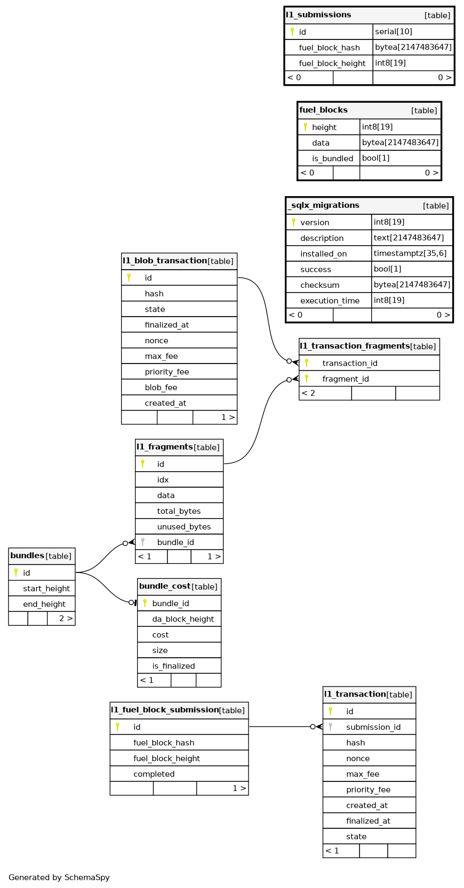

# fuel-block-committer

The Fuel Block Committer is a standalone service dedicated to uploading Fuel Block metadata to Ethereum.

## Building

Building the project doesn't require any special steps beyond the standard Cargo build process.

```shell
cargo build
```

## Testing

To run the end-to-end (e2e) tests, you need to have the following installed and available in your `PATH`:

- [Foundry](https://github.com/foundry-rs/foundry)
- [fuel-core](https://github.com/FuelLabs/fuelup) (can be installed via [fuelup](https://github.com/FuelLabs/fuelup))
- fuel-block-committer

You can also use `run_tests.sh`, which takes care of building the `fuel-block-committer` binary and making it available on `PATH` prior to running the e2e tests.

```shell
./run_tests.sh
```

## Configuration

The Fuel Block Committer is configured primarily through environment variables.

### Environment Variables

#### Ethereum (ETH) Configuration

- **`COMMITTER__ETH__L1_KEYS__MAIN`**

  - **Description:** The Ethereum key authorized by the L1 fuel chain state contract to post block commitments.
  - **Format:** `Kms(<KEY_ARN>)` or `Private(<PRIVATE_KEY>)`
  - **Example:** `Kms(arn:aws:kms:us-east-1:123456789012:key/abcd-1234)`

- **`COMMITTER__ETH__L1_KEYS__BLOB`**

  - **Description:** (Optional) The Ethereum key for posting L2 state to L1.
  - **Format:** `Kms(<KEY_ARN>)` or `Private(<PRIVATE_KEY>)`
  - **Example:** `Kms(arn:aws:kms:us-east-1:123456789012:key/efgh-5678)`

- **`COMMITTER__ETH__RPC`**

  - **Description:** URL to the Ethereum RPC endpoint.
  - **Example:** `https://mainnet.infura.io/v3/YOUR_INFURA_PROJECT_ID`

- **`COMMITTER__ETH__STATE_CONTRACT_ADDRESS`**
  - **Description:** Ethereum address of the Fuel chain state contract.
  - **Example:** `0xYourStateContractAddress`

#### Fuel Configuration

- **`COMMITTER__FUEL__GRAPHQL_ENDPOINT`**

  - **Description:** URL to a Fuel Core GraphQL endpoint.
  - **Example:** `http://localhost:4000/graphql`

- **`COMMITTER__FUEL__NUM_BUFFERED_REQUESTS`**
  - **Description:** Number of concurrent http requests towards the fuel node.
  - **Type:** Positive integer
  - **Example:** `5`

#### Database (DB) Configuration

- **`COMMITTER__APP__DB__HOST`**

  - **Description:** Hostname or IP address of the PostgreSQL server.
  - **Example:** `localhost`

- **`COMMITTER__APP__DB__PORT`**

  - **Description:** Port number on which the PostgreSQL server is listening.
  - **Type:** `u16`
  - **Example:** `5432`

- **`COMMITTER__APP__DB__USERNAME`**

  - **Description:** Username for authenticating with the PostgreSQL server.
  - **Example:** `username`

- **`COMMITTER__APP__DB__PASSWORD`**

  - **Description:** Password for authenticating with the PostgreSQL server.
  - **Example:** `password`

- **`COMMITTER__APP__DB__DATABASE`**

  - **Description:** Name of the database to connect to on the PostgreSQL server.
  - **Example:** `fuel_db`

- **`COMMITTER__APP__DB__MAX_CONNECTIONS`**

  - **Description:** Maximum number of connections allowed in the connection pool.
  - **Type:** `u32`
  - **Example:** `10`

- **`COMMITTER__APP__DB__USE_SSL`**
  - **Description:** Whether to use SSL when connecting to the PostgreSQL server.
  - **Type:** `bool`
  - **Values:** `true` or `false`
  - **Example:** `false`

#### Application (App) Configuration

- **`COMMITTER__APP__PORT`**

  - **Description:** Port used by the started server.
  - **Type:** `u16`
  - **Example:** `8080`

- **`COMMITTER__APP__HOST`**

  - **Description:** IPv4 address on which the server will listen for connections.
  - **Example:** `127.0.0.1`

- **`COMMITTER__APP__BLOCK_CHECK_INTERVAL`**

  - **Description:** How often to check for new fuel blocks.
  - **Format:** Human-readable duration (e.g., `5s`, `1m`)
  - **Example:** `5s`

- **`COMMITTER__APP__TX_FINALIZATION_CHECK_INTERVAL`**

  - **Description:** How often to check for finalized L1 transactions.
  - **Format:** Human-readable duration
  - **Example:** `5s`

- **`COMMITTER__APP__NUM_BLOCKS_TO_FINALIZE_TX`**

  - **Description:** Number of L1 blocks that need to pass to accept the transaction as finalized.
  - **Type:** `u64`
  - **Example:** `3`

- **`COMMITTER__APP__GAS_BUMP_TIMEOUT`**

  - **Description:** Interval after which to bump a pending transaction.
  - **Format:** Human-readable duration
  - **Example:** `300s`

- **`COMMITTER__APP__TX_MAX_FEE`**

  - **Description:** Maximum gas fee permitted for a transaction in wei.
  - **Type:** `u64`
  - **Example:** `4000000000000000`

- **`COMMITTER__APP__SEND_TX_REQUEST_TIMEOUT`**
  - **Description:** Duration for timeout when sending transaction requests.
  - **Format:** Human-readable duration
  - **Example:** `10s`

#### Bundle Configuration

- **`COMMITTER__APP__BUNDLE__ACCUMULATION_TIMEOUT`**

  - **Description:** Duration to wait for additional fuel blocks before initiating the bundling process.
  - **Format:** Human-readable duration
  - **Example:** `30s`

- **`COMMITTER__APP__BUNDLE__BLOCKS_TO_ACCUMULATE`**

  - **Description:** Number of fuel blocks to accumulate before initiating the bundling process.
  - **Type:** Positive integer
  - **Example:** `5`

- **`COMMITTER__APP__BUNDLE__OPTIMIZATION_TIMEOUT`**

  - **Description:** Maximum duration allocated for determining the optimal bundle size.
  - **Format:** Human-readable duration
  - **Example:** `60s`

- **`COMMITTER__APP__BUNDLE__COMPRESSION_LEVEL`**

  - **Description:** Compression level used for compressing block data before submission.
  - **Values:** `"disabled"`, `"min"`, `"level1"`..`"level9"`, `"max"`
  - **Example:** `"min"`

- **`COMMITTER__APP__BUNDLE__OPTIMIZATION_STEP`**

  - **Description:** Size of the optimization step at the start of the optimization process.
  - **Type:** Positive integer (`NonZeroUsize`)
  - **Example:** `100`

- **`COMMITTER__APP__BUNDLE__FRAGMENTS_TO_ACCUMULATE`**

  - **Description:** Number of fragments to accumulate before submitting them in a transaction to L1.
  - **Type:** Positive integer (`NonZeroUsize`)
  - **Example:** `6`

- **`COMMITTER__APP__BUNDLE__FRAGMENT_ACCUMULATION_TIMEOUT`**

  - **Description:** Duration to wait for additional fragments before submitting them.
  - **Format:** Human-readable duration
  - **Example:** `30s`

- **`COMMITTER__APP__BUNDLE__NEW_BUNDLE_CHECK_INTERVAL`**
  - **Description:** Duration to wait before checking if a new bundle can be made.
  - **Format:** Human-readable duration
  - **Example:** `15s`

### Configuration Validation

The committer performs validation on the provided configuration to ensure consistency and correctness. For example:

- **Wallet Keys:** The main wallet key and blob pool wallet key must be different.
- **Fragments to Accumulate:** Must be less than or equal to 6.
- **Block Height Lookback:** Must be greater than or equal to the number of blocks to accumulate.

If any validation fails, the committer will return an error, preventing it from running with invalid settings.

## Schema Visualization



We use [SchemaSpy](https://github.com/schemaspy/schemaspy) to generate visual representations of the database schema in both `.dot` and `.png` formats.

### Generating Schema Diagrams

The CI pipeline is configured to automatically run the `update_db_preview.sh` script and check for any updates to the `db_preview` directory. If there are changes (e.g., new or modified `.dot` files), the CI step will fail, prompting you to commit these updates. This ensures that the repository remains in sync with the latest database schema visualizations.

#### Prerequisites

Before running the script, ensure you have the following installed:

- [Docker](https://www.docker.com/get-started) (required for running SchemaSpy)
- [Sqlx CLI](https://github.com/launchbadge/sqlx/tree/main/sqlx-cli) (required for running migrations)
