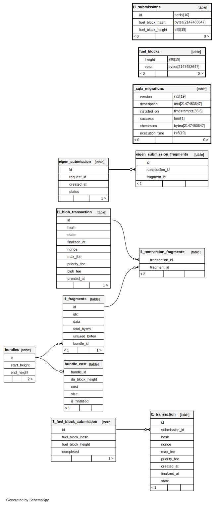

# fuel-block-committer

The Fuel Block Committer is a standalone service dedicated to uploading Fuel Block metadata to Ethereum.

## Table of Contents

- [Building](#building)
- [Testing](#testing)
- [Schema Visualization](#schema-visualization)
  - [Generating Schema Diagrams](#generating-schema-diagrams)
- [Configuration](#configuration)
  - [Environment Variables](#environment-variables)
    - [Ethereum (ETH) Configuration](#ethereum-eth-configuration)
    - [Fuel Configuration](#fuel-configuration)
    - [Database (DB) Configuration](#database-db-configuration)
    - [Application (App) Configuration](#application-app-configuration)
    - [Bundle Configuration](#bundle-configuration)
    - [DA Layer Configuration](#da-layer-configuration)
  - [Configuration Validation](#configuration-validation)
- [Running the Fee Algo Simulator](#running-the-fee-algo-simulator)

## Building

Building the project doesn't require any special steps beyond the standard Cargo build process.

```shell
cargo build
```

## Testing

To run the end-to-end (e2e) tests, you need to have the following installed and available in your `PATH`:

- [Foundry](https://github.com/foundry-rs/foundry)
- [Fuel Core](https://github.com/FuelLabs/fuelup) (can be installed via [fuelup](https://github.com/FuelLabs/fuelup))
- `fuel-block-committer` binary

You can also use `run_tests.sh`, which takes care of building the `fuel-block-committer` binary and making it available on `PATH` prior to running the e2e tests.

```shell
./run_tests.sh
```

## Schema Visualization



We use [SchemaSpy](https://github.com/schemaspy/schemaspy) to generate visual representations of the database schema in both `.dot` and `.png` formats.

### Generating Schema Diagrams

The CI pipeline is configured to automatically run the `update_db_preview.sh` script and check for any updates to the `db_preview` directory. If there are changes (e.g., new or modified `.dot` files), the CI step will fail, prompting you to commit these updates. This ensures that the repository remains in sync with the latest database schema visualizations.

#### Prerequisites

Before running the script, ensure you have the following installed:

- [Docker](https://www.docker.com/get-started) (required for running SchemaSpy)
- [Sqlx CLI](https://github.com/launchbadge/sqlx/tree/main/sqlx-cli) (required for running migrations)

## Configuration

The Fuel Block Committer is configured primarily through environment variables.

### Environment Variables

#### Ethereum (ETH) Configuration

- **`COMMITTER__ETH__L1_KEYS__MAIN`**

  - **Description:** The Ethereum key authorized by the L1 Fuel chain state contract to post block commitments.
  - **Format:** `Kms(<KEY_ARN>)` or `Private(<PRIVATE_KEY>)`
  - **Example:** `Kms(arn:aws:kms:us-east-1:123456789012:key/abcd-1234)`

- **`COMMITTER__ETH__L1_KEYS__BLOB`**

  - **Description:** (Optional) The Ethereum key for posting L2 state to L1.
  - **Format:** `Kms(<KEY_ARN>)` or `Private(<PRIVATE_KEY>)`
  - **Example:** `Kms(arn:aws:kms:us-east-1:123456789012:key/efgh-5678)`

- **`COMMITTER__ETH__RPC`**

  - **Description:** URL to the Ethereum RPC endpoint.
  - **Example:** `https://mainnet.infura.io/v3/YOUR_INFURA_PROJECT_ID`

- **`COMMITTER__ETH__STATE_CONTRACT_ADDRESS`**
  - **Description:** Ethereum address of the Fuel chain state contract.
  - **Example:** `0xYourStateContractAddress`

#### Fuel Configuration

- **`COMMITTER__FUEL__GRAPHQL_ENDPOINT`**

  - **Description:** URL to a Fuel Core GraphQL endpoint.
  - **Example:** `http://localhost:4000/graphql`

- **`COMMITTER__FUEL__NUM_BUFFERED_REQUESTS`**

  - **Description:** Number of concurrent HTTP requests towards the Fuel node.
  - **Type:** Positive integer
  - **Example:** `5`

#### Database (DB) Configuration

- **`COMMITTER__APP__DB__HOST`**

  - **Description:** Hostname or IP address of the PostgreSQL server.
  - **Example:** `localhost`

- **`COMMITTER__APP__DB__PORT`**

  - **Description:** Port number on which the PostgreSQL server is listening.
  - **Type:** `u16`
  - **Example:** `5432`

- **`COMMITTER__APP__DB__USERNAME`**

  - **Description:** Username for authenticating with the PostgreSQL server.
  - **Example:** `username`

- **`COMMITTER__APP__DB__PASSWORD`**

  - **Description:** Password for authenticating with the PostgreSQL server.
  - **Example:** `password`

- **`COMMITTER__APP__DB__DATABASE`**

  - **Description:** Name of the database to connect to on the PostgreSQL server.
  - **Example:** `fuel_db`

- **`COMMITTER__APP__DB__MAX_CONNECTIONS`**

  - **Description:** Maximum number of connections allowed in the connection pool.
  - **Type:** `u32`
  - **Example:** `10`

- **`COMMITTER__APP__DB__USE_SSL`**

  - **Description:** Whether to use SSL when connecting to the PostgreSQL server.
  - **Type:** `bool`
  - **Values:** `true` or `false`
  - **Example:** `false`

#### Application (App) Configuration

- **`COMMITTER__APP__PORT`**

  - **Description:** Port used by the started server.
  - **Type:** `u16`
  - **Example:** `8080`

- **`COMMITTER__APP__HOST`**

  - **Description:** IPv4 address on which the server will listen for connections.
  - **Example:** `127.0.0.1`

- **`COMMITTER__APP__BLOCK_CHECK_INTERVAL`**

  - **Description:** How often to check for new Fuel blocks.
  - **Format:** Human-readable duration (e.g., `5s`, `1m`)
  - **Example:** `5s`

- **`COMMITTER__APP__TX_FINALIZATION_CHECK_INTERVAL`**

  - **Description:** How often to check for finalized L1 transactions.
  - **Format:** Human-readable duration
  - **Example:** `5s`

- **`COMMITTER__APP__L1_FEE_CHECK_INTERVAL`**

  - **Description:** How often to check for L1 fees.
  - **Format:** Human-readable duration
  - **Example:** `10s`

- **`COMMITTER__APP__NUM_BLOCKS_TO_FINALIZE_TX`**

  - **Description:** Number of L1 blocks that need to pass to accept the transaction as finalized.
  - **Type:** `u64`
  - **Example:** `3`

- **`COMMITTER__APP__GAS_BUMP_TIMEOUT`**

  - **Description:** Interval after which to bump a pending transaction.
  - **Format:** Human-readable duration
  - **Example:** `300s`

- **`COMMITTER__APP__TX_FEES__MAX`**

  - **Description:** Maximum gas fee permitted for a transaction in wei.
  - **Type:** `u64`
  - **Example:** `4000000000000000`

- **`COMMITTER__APP__TX_FEES__MIN_REWARD_PERC`**

  - **Description:** Lowest reward percentage to use when the system is up to date with L2 block posting.
  - **Type:** `f64`
  - **Example:** `20.0`

- **`COMMITTER__APP__TX_FEES__MAX_REWARD_PERC`**

  - **Description:** Highest reward percentage to use when the system is very late with L2 block posting.
  - **Type:** `f64`
  - **Example:** `30.0`

- **`COMMITTER__APP__SEND_TX_REQUEST_TIMEOUT`**

  - **Description:** Duration for timeout when sending transaction requests.
  - **Format:** Human-readable duration
  - **Example:** `10s`

- **`COMMITTER__APP__STATE_PRUNER_RETENTION`**

  - **Description:** Retention duration for state pruner.
  - **Format:** Human-readable duration
  - **Example:** `1h`

- **`COMMITTER__APP__STATE_PRUNER_RUN_INTERVAL`**

  - **Description:** How often to run the state pruner.
  - **Format:** Human-readable duration
  - **Example:** `30m`

- **`COMMITTER__APP__FEE_ALGO_SHORT_SMA_BLOCKS`**

  - **Description:** Short-term period for the fee algorithm in block numbers.
  - **Type:** Positive integer (`NonZeroU64`)
  - **Example:** `25`

- **`COMMITTER__APP__FEE_ALGO_LONG_SMA_BLOCKS`**

  - **Description:** Long-term period for the fee algorithm in block numbers.
  - **Type:** Positive integer (`NonZeroU64`)
  - **Example:** `300`

- **`COMMITTER__APP__FEE_ALGO_MAX_L2_BLOCKS_BEHIND`**

  - **Description:** Maximum number of unposted L2 blocks before forcing a transaction regardless of fees.
  - **Type:** Positive integer (`NonZeroU32`)
  - **Example:** `28800`

- **`COMMITTER__APP__FEE_ALGO_START_MAX_FEE_MULTIPLIER`**

  - **Description:** Starting fee multiplier applied when the system is fully up to date (i.e., 0 L2 blocks behind).
  - **Type:** `f64`
  - **Example:** `0.800000`

- **`COMMITTER__APP__FEE_ALGO_END_MAX_FEE_MULTIPLIER`**

  - **Description:** Ending fee multiplier applied when the system is nearly at the maximum allowed lag (i.e., `max_l2_blocks_behind - 1`).
  - **Type:** `f64`
  - **Example:** `1.200000`

- **`COMMITTER__APP__FEE_ALGO_ALWAYS_ACCEPTABLE_FEE`**

  - **Description:** A fee that is always acceptable regardless of other conditions.
  - **Type:** `u64`
  - **Example:** `1000000000000000`

#### Bundle Configuration

- **`COMMITTER__APP__BUNDLE__ACCUMULATION_TIMEOUT`**

  - **Description:** Duration to wait for additional Fuel blocks before initiating the bundling process.
  - **Format:** Human-readable duration
  - **Example:** `30s`

- **`COMMITTER__APP__BUNDLE__BYTES_TO_ACCUMULATE`**

  - **Description:** Byte threshold that, if reached before the accumulation timeout expires, will trigger bundling immediately.
  - **Format:** Human-readable byte string (e.g., `10MB`, `500KB`)
  - **Example:** `1MB`

- **`COMMITTER__APP__BUNDLE__BLOCKS_TO_ACCUMULATE`**

  - **Description:** Number of Fuel blocks to accumulate before initiating the bundling process.
  - **Type:** Positive integer (`NonZeroUsize`)
  - **Example:** `5`

- **`COMMITTER__APP__BUNDLE__MAX_FRAGMENTS_PER_BUNDLE`**

  - **Description:** Maximum number of fragments allowed per bundle. This limits the size of any individual bundle.
  - **Type:** Positive integer (`NonZeroUsize`)
  - **Example:** `10`

- **`COMMITTER__APP__BUNDLE__OPTIMIZATION_TIMEOUT`**

  - **Description:** Maximum duration allocated for determining the optimal bundle size.
  - **Format:** Human-readable duration
  - **Example:** `60s`

- **`COMMITTER__APP__BUNDLE__OPTIMIZATION_STEP`**

  - **Description:** Step size used during the optimization search for the ideal bundle size.
  - **Type:** Positive integer (`NonZeroUsize`)
  - **Example:** `100`

- **`COMMITTER__APP__BUNDLE__FRAGMENTS_TO_ACCUMULATE`**

  - **Description:** Number of fragments to accumulate before submitting them in a transaction to L1.
  - **Type:** Positive integer (`NonZeroUsize`)
  - **Example:** `6`
  - **Note:** This value must be less than or equal to 6.

- **`COMMITTER__APP__BUNDLE__FRAGMENT_ACCUMULATION_TIMEOUT`**

  - **Description:** Duration to wait for additional fragments before submitting them.
  - **Format:** Human-readable duration
  - **Example:** `30s`

- **`COMMITTER__APP__BUNDLE__NEW_BUNDLE_CHECK_INTERVAL`**

  - **Description:** Duration to wait before checking if a new bundle can be created.
  - **Format:** Human-readable duration
  - **Example:** `15s`

- **`COMMITTER__APP__BUNDLE__BLOCK_HEIGHT_LOOKBACK`**

  - **Description:** The lookback window (in block numbers) used to determine which blocks are eligible for bundling. Blocks outside this window will be ignored.
  - **Type:** `u32`
  - **Example:** `100`

- **`COMMITTER__APP__BUNDLE__COMPRESSION_LEVEL`**

  - **Description:** Compression level used for compressing block data before submission.
  - **Allowed Values:** `"disabled"`, `"min"`, or any value up to `"max"` (`"level1"`, `"level2"`, ...)
  - **Example:** `"min"`

#### DA Layer Configuration

- **`COMMITTER__DA_LAYER__TYPE`**

  - **Description:** Specifies the Data Availability layer type to use.
  - **Allowed Values:** `"EigenDA"`
  - **Example:** `EigenDA`

- **`COMMITTER__DA_LAYER__KEY`**

  - **Description:** Authentication key for posting requests to the EigenDA disperser.
  - **Format:** `Private(0x...)` for private keys or `Kms(key-id)` for AWS KMS keys
  - **Example:** `Kms(arn:aws:kms:us-east-1:123456789012:key/12345678-1234-1234-1234-123456789012)`

- **`COMMITTER__DA_LAYER__DISPERSER_RPC_URL`**

  - **Description:** URL endpoint for the EigenDA disperser RPC service.
  - **Format:** Valid URL
  - **Example:** `https://disperser-holesky.eigenda.xyz`

- **`COMMITTER__DA_LAYER__FRAGMENT_SIZE`**

  - **Description:** Size of blob fragments sent to EigenDA. Defaults to 3.5MB if not specified.
  - **Type:** Positive integer (`NonZeroU32`) in bytes
  - **Example:** `3670016`
  - **Note:** Values over 4MB may cause server-side errors during inclusion checks.

- **`COMMITTER__DA_LAYER__FEE_CHECK_INTERVAL`**

  - **Description:** Interval for checking EigenDA fees.
  - **Format:** Human-readable duration
  - **Example:** `30s`

- **`COMMITTER__DA_LAYER__POLLING_INTERVAL`**

  - **Description:** Interval for polling EigenDA status. Defaults to 1 second if not specified.
  - **Format:** Human-readable duration
  - **Example:** `2s`

- **`COMMITTER__DA_LAYER__API_THROUGHPUT`**

  - **Description:** Allocated API throughput limit in bytes/s for the authenticated address. Defaults to 16 MiB/s if not specified.
  - **Type:** `u32`
  - **Example:** `16777216`

- **`COMMITTER__DA_LAYER__ETH_RPC_URL`**

  - **Description:** URL endpoint for the Ethereum RPC service used by EigenDA.
  - **Format:** Valid URL
  - **Example:** `https://ethereum-holesky-rpc.publicnode.com`

- **`COMMITTER__DA_LAYER__CERT_VERIFIER_ADDRESS`**

  - **Description:** Address of the certificate verifier contract. Get it from the EigenDA documentation or deployment details.
  - **Type:** String
  - **Example:** `0x1234567890123456789012345678901234567890`

- **`COMMITTER__DA_LAYER__REGISTRY_COORDINATOR_ADDRESS`**

  - **Description:** Address of the registry coordinator contract. Get it from the EigenDA documentation or deployment details.
  - **Type:** String
  - **Example:** `0x0987654321098765432109876543210987654321`

- **`COMMITTER__DA_LAYER__OPERATOR_STATE_RETRIEVER_ADDRESS`**

  - **Description:** Address of the operator state retriever contract. Get it from the EigenDA documentation or deployment details.
  - **Type:** String
  - **Example:** `0x1122334455667788990011223344556677889900`

### Configuration Validation

At startup, the committer validates the provided configuration to ensure that:

- **Wallet Keys:** The main wallet key and blob pool wallet key must be different.
- **Fragments to Accumulate:** The number of fragments to accumulate is checked to be less than or equal to 6.
- **Fee Algorithm Settings:** The fee multiplier range (start and end multipliers) is verified to be valid.

If any validation fails, the committer will exit with an error message, preventing it from running with invalid settings.

## Running the Fee Algo Simulator

The **Fee Algo Simulator** is a separate binary designed to simulate and analyze fee algorithms using data from Ethereum mainnet.

### Running the Simulator

To run the Fee Algo Simulator, execute the following command:

```shell
cargo run --release --bin fee_algo_simulation
```
